# Drug Candidate Development against Non-alcoholic Steato Hepatitis

## Background
Non-alcoholic fatty liver disease (NAFLD) is defined as the ectopic accumulation of fat in the liver (hepatic steatosis) when no other causes of secondary liver fat accumulation are present. Although minor deposition of fat can occur in the livers of healthy adults, deposition of fat in at least 5% of hepatocytes is considered pathological. NAFLD includes both nonalcoholic fatty liver (NAFL) and nonalcoholic steatohepatitis (NASH), which is diagnosed when there is evidence of inflammatory activity and hepatocyte injury in steatotic liver tissue (Pang et al. .,2019, Hester et al ., 2020, Kaplan et al., 2019). Nonalcoholic fatty liver disease (NAFLD), including nonalcoholic steatohepatitis (NASH), reportedly affects the health status of approximately one in four people worldwide according to a recent meta-analysis ( Younossi et al., 2016). Nonalcoholic steatohepatitis (NASH) is the most severe form of nonalcoholic fatty liver disease (NAFLD), a condition in which the liver builds up excessive fat deposits. NASH clearly progresses to cirrhosis with further decompensation, leading to death or liver transplantation in some individuals (Goh et al., 2016, Chalasani et al. ., 2018, Asrani et al., 2019,) 

It is estimated that over 115 million adults are affected by NASH worldwide (Tesfay et al ., 2018). NASH is currently the fastest-rising cause of hepatocellular carcinoma (HCC) worldwide (Tan et al. ., 2022, Huang et al., 2022). Approximately 25% of the adult population worldwide has NAFLD, with the highest prevalence rates in South America (31%) and the Middle East (32%) and the lowest rate in Africa (14%). The prevalence of NASH in adults has been approximated to be 1.5% – 6.45% (Younossi et al. ., 2016). Globally, NAFL/NASH is estimated to account for approximately 25% of the population. The global prevalence of NASH among patients with T2DM is 37.3%. Approximately 17% of the patients with NAFL/NASH and T2DM develop advanced fibrosis. Furthermore, the frequency and severity of NAFL/NASH vary according to the geographic region and ethnicity. Specifically, the Middle East was found to have the highest frequency of NAFL/NASH (31.79%), followed by Asia (27.37%), South America (24.13%), North America (24.13%), and Europe (23.71%), whereas Africa had the lowest prevalence (13.48%) (Mitra et al., 2020, Younossi et al., 2016 ). By 2030, the number of people with NASH in China is expected to reach 48.26 million. Spain had 1.8 million cases in Europe in 2016, with the number expected to increase by 49% by 2030. German cases of NASH stood at 3.33 million in 2016 and are projected to increase by 43% by 2030. In addition, researchers anticipate 27 million cases of NASH in the U.S. by 2030 (Estes et al., 2018). Not only does an increase in NASH cases negatively impact lives, but there can also be a steep economic impact on patients and their families, payers, and governments. In the U.S., the annual direct cost of treating NAFLD reaches $103 billion, while four European countries (Germany, France, Italy, and the United Kingdom) spend approximately €35 billion a year (Younossi et al., 2016).

People with cirrhosis (severe fibrosis or scarring) of the liver related to NASH may experience; Intense itching, Abdominal swelling, Easy bruising and bleeding, Jaundice (yellowing of the skin and eyes), Spider-like blood vessels beneath the skin's surface, Behavior changes, confusion, and slurred speech  ( Sharma et al., 2023). No medications have been approved for the treatment of NAFLD, including NASH, but researchers are currently studying different potential therapies for NASH. 

The Farnesoid X Receptor (FXR), a ligand-activated nuclear receptor transcription factor is considered a crucial and viable target since it is a key metabolic regulator of bile acid homeostasis, inflammation, and metabolism of lipids. 

## Objective
This study seeks to identify novel potential agonists of FXR, presenting promising candidates for drug development aimed at treating Non-Alcoholic Steato Hepatitis (NASH). 

## Methods
- FXR, a bile acid nuclear receptor, is a master regulator of bile acid synthesis, excretion, and absorption. As such, FXR has been a hot drug target for the development of treatments for NASH
- 3D-AF-Surfer, protein structure models of FXR generated by AlphaFold2 for 21 proteomes were retrieved from the European Bioinformatics Institute’s FTP server of the AlphaFold Database (https://ftp.ebi.ac.uk/pub/databases/alphafold).
- Subsequent improvement of the tertiary structure of the vaccine construct were done with the GalaxyRefined (https://galaxy.seoklab.org/cgi-bin/submit.cgi?ty.pe=REFINE)
- Structure energy minimisation were done using gromacs (https://gromacs.bioexcel.eu/t/energy-minimization-and-stereochemistry/506/4) best minismised structure was obtained through OPLS force field
- The results obtained from the galaxy were validated using PROCHECK (https://saves.mbi.ucla.edu/)
- Libray preparation; Initially, 1871 compounds were selected after a rigorous literature review and NANPDB (http://african-compounds.org/nanpdb)
- Compound screening; FAF-Drugs (Free ADME-Tox Filtering Tool version 4.0) (https://bioserv.rpbs.univ-paris-diderot.fr/services.html)  is a program for filtering large compound libraries prior to in silico screening experiments or related modeling studies.
- LigandScout 4.3 (http://www.inteligand.com/ligandscout) is a fully integrated platform for accurate virtual screening based on 3D chemical pharmacophore models. It offers seamless workflows, starting from both ligand- and structure-based pharmacophore modeling

## Workflow
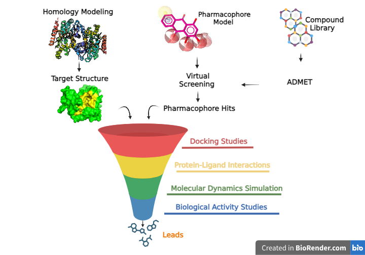

###

###

## Result

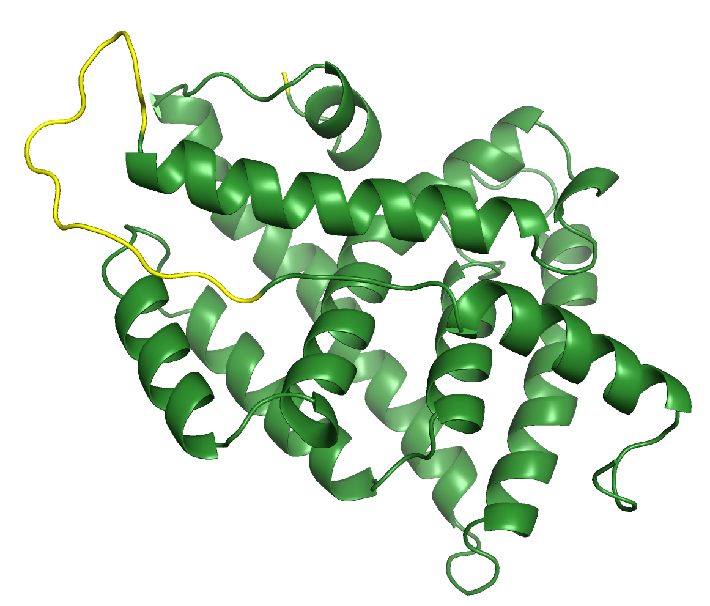
Structure of redesigned FXR protein. 

###
###

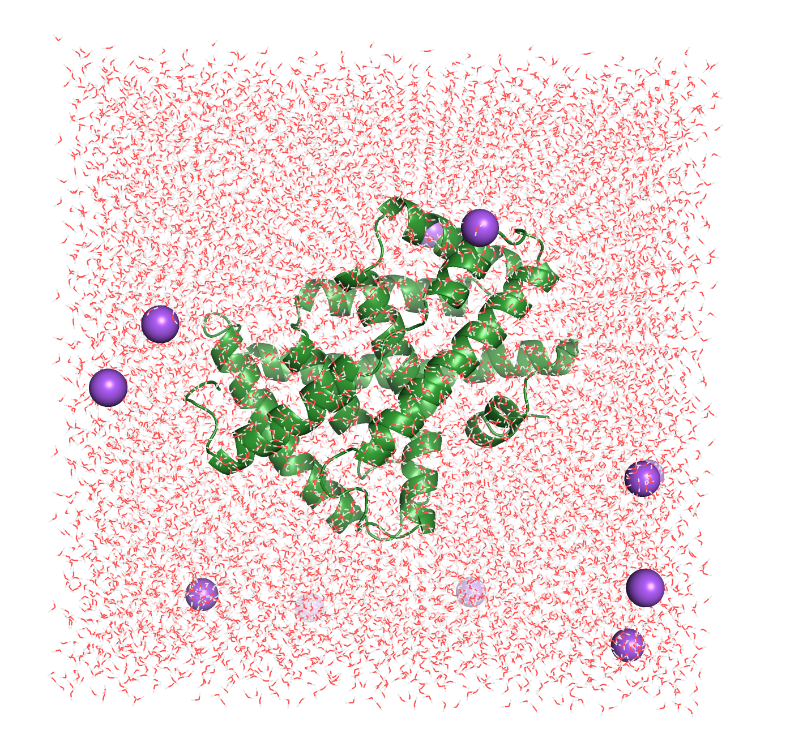
Energy minimized structure 

###
###

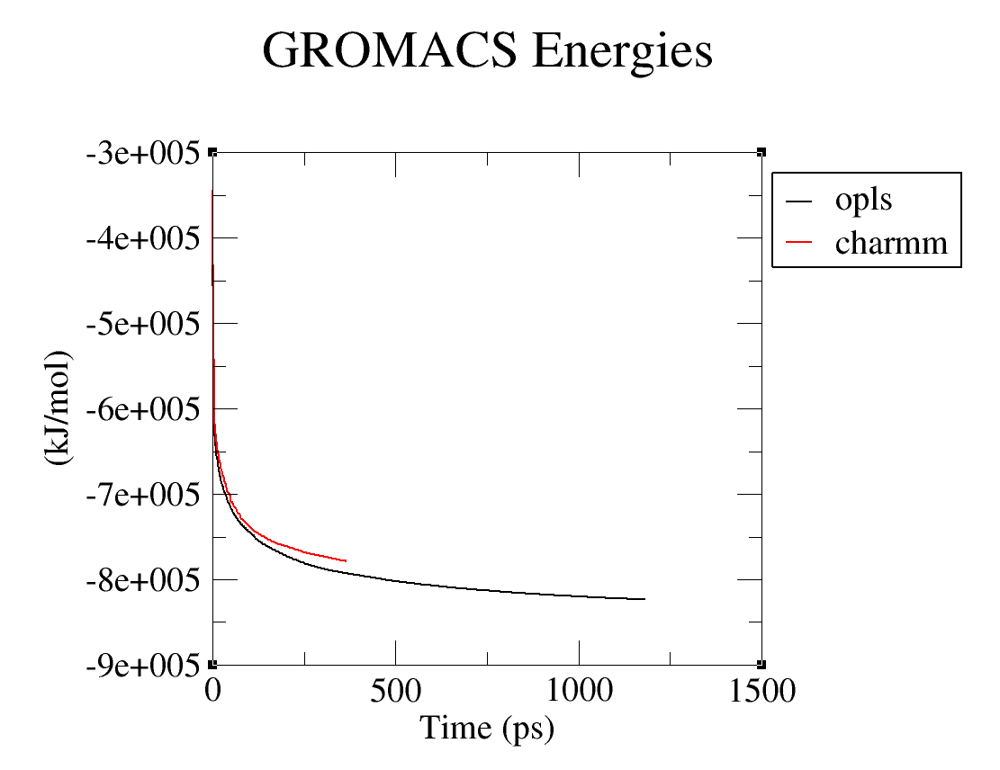
Potential energy graph 

###
###

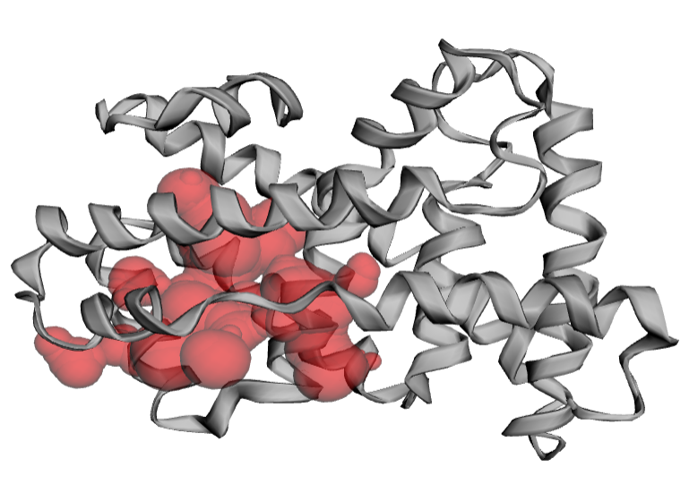
Predicted binding pocket from CASTp

###
###
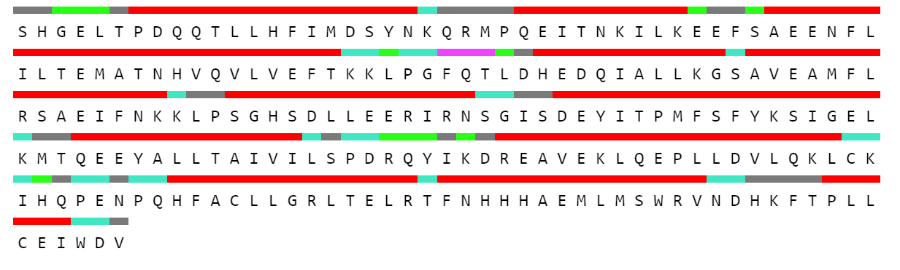
Corresponding binding amino acid residues in the binding pocket (red) 

###
###

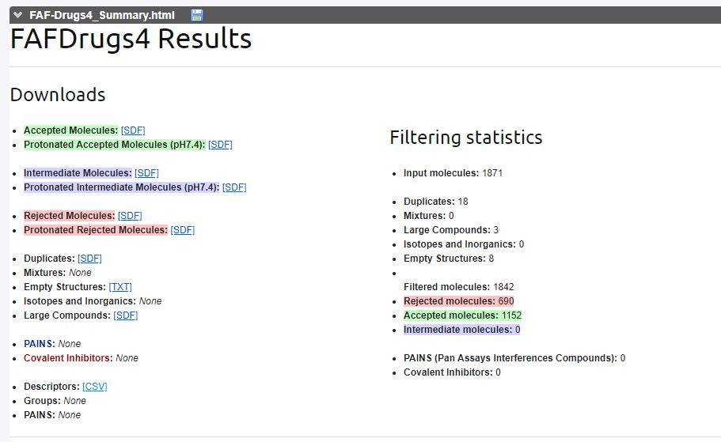
Job Summary from EANPDB Drug likeness filtering with FAF-Drugs4.1

###
###

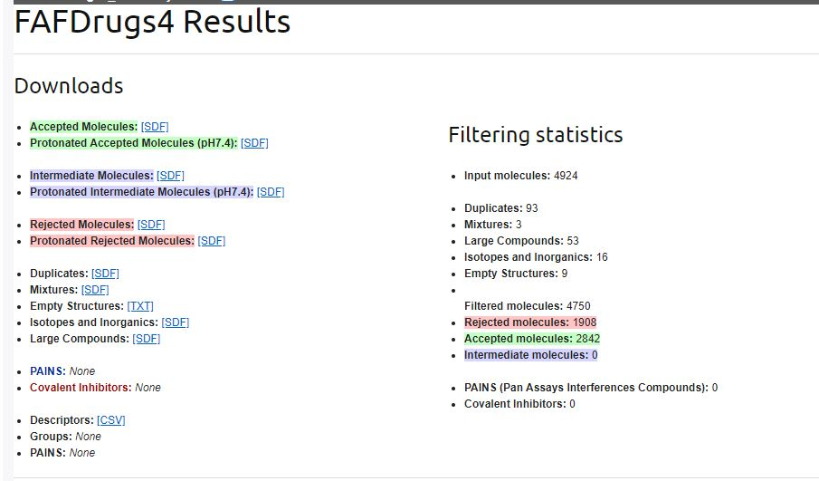
Job Summary from NANPDB Drug likeness filtering with FAF-Drugs4.1

###Pharmacophore Generation and Screening 

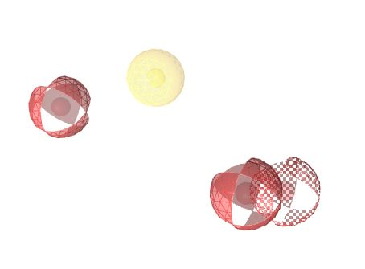
Generated Pharmacophore Model showing features (3 HBA and 1 H)

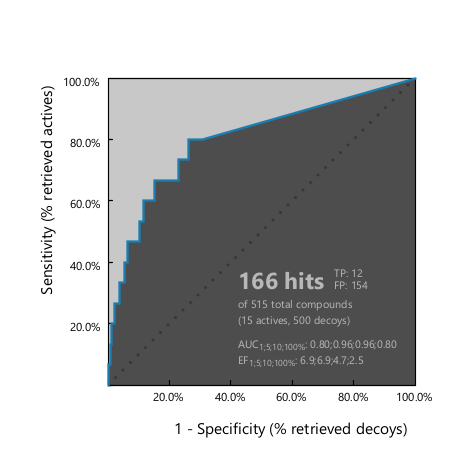
ROC curve of validated pharmacophore 

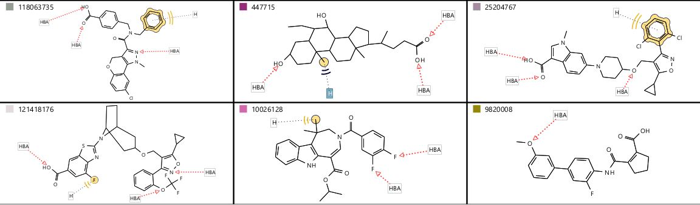
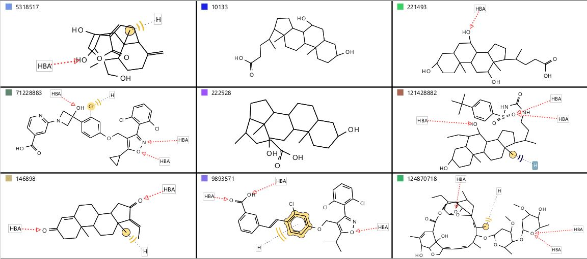
All inhibitors used in model generation and thier shared features 

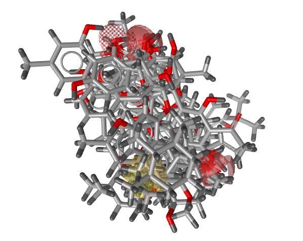
Top 10 Pharmacophore-Hits mapped onto generated Pharmacophore model

## Conclusion

## Team Members
1. Chimenya Ntweya (Department of Biotechnology and Bioinformatics, Deogiri College, Aurangabad, India; Department of Medical Laboratory, Queen Elizabeth Central Hospital, Blantyre, Malawi) chimenyantweya54@gmail.com)
2. Desmond Osarfo Amoah (Department of Parasitology, Noguchi Memorial Institute for Medical Research, University of Ghana) desmondqwejo@gmail.com)
3. Oudou Diabate (diabateoudou@gmail.com), African Centre of Excellence in Bioinformatics (ACE-B), University of Sciences, Techniques and Technologies of Bamako (USTTB), Mali
4. Olaitan I.Awe (laitanawe@gmail.com), African Society for Bioinformatics and Computational Biology, Cape Town, South Africa

